# Architecture & Technical Design Report: Real-Time E-Commerce Streaming Analytics Platform

## Executive Summary

The **Real-Time E-Commerce Streaming Analytics Platform** is a production-grade, distributed Event-Driven Architecture (EDA) built to simulate and process high-throughput e-commerce interactions. Operating at an ingestion volume of **~100 events/second** (~8.6 million events/day), the platform ingests heterogeneous streams (Orders, Payments, Clicks, Reviews), performs distributed streaming transformations with micro-batch windowing in Apache Spark, persists raw and aggregated data idempotently into PostgreSQL, and presents sub-minute analytical KPIs via an auto-provisioned Grafana monitoring suite.

The platform is designed to operate on a containerized local or cloud footprint (Docker Compose) at **zero software licensing cost**, leveraging battle-tested open-source components configured with enterprise-grade durability and idempotency patterns.

---

## High-Level System Architecture & Component Topology

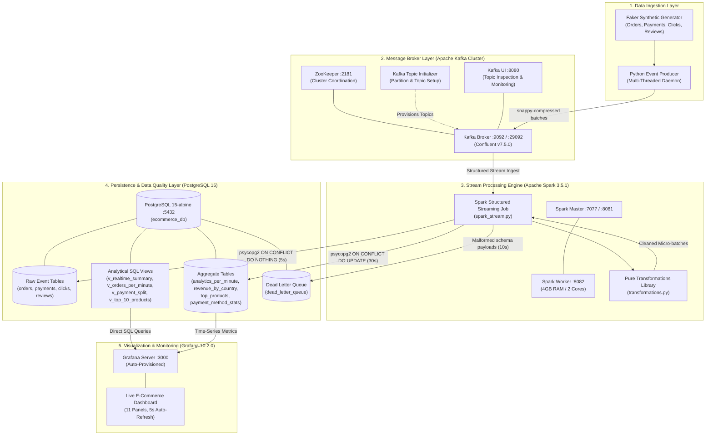

---

## Core Architectural Layers & Component Analysis

### 1. Ingestion Subsystem (`producer/`)

The ingestion engine simulates real-world user activity across an Indian e-commerce catalog with currency, category, and regional variance.

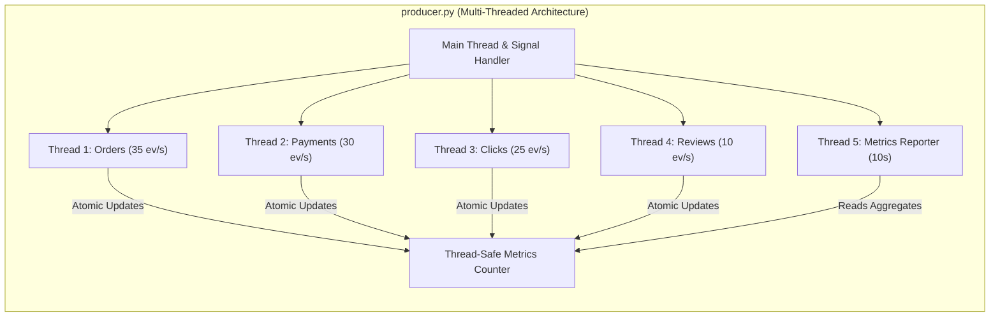

#### Engineering Mechanisms
- **Thread-per-Topic Concurrency**: Separate daemon threads generate events independently using precise sleep intervals (`interval = 1.0 / rate - loop_time`) to eliminate thread contention and maintain stable throughput.
- **Producer Configuration & Delivery Guarantees**:
  - `acks=all`: High durability guarantee requiring all in-sync replicas to acknowledge writes.
  - `enable.idempotence=True`: Eliminates producer retries resulting in duplicate broker-side messages.
  - `compression.type=snappy`: CPU-efficient compression minimizing network I/O overhead.
  - `linger.ms=5` and `batch.size=16384`: Batches writes up to 5 milliseconds or 16 KB for maximum network efficiency.
  - `max.in.flight.requests.per.connection=5`: Maintains order consistency without pipeline stalls.
- **Backpressure & Fault Handling**:
  - Consecutive error counter pauses threads for 10 seconds if more than 5 consecutive broker failures occur.
  - Exponential backoff connection probe (`wait_for_kafka`) checks broker readiness up to 20 attempts before initiating traffic.
- **Delivery Callbacks**: Asynchronous `delivery_report` callback processes acks non-blockingly via `producer.poll(0)`.

#### Event Distribution Profile

| Stream | Target Rate | Global % | Partition Key | Primary Payload Attributes |
| :--- | :--- | :--- | :--- | :--- |
| **Orders** | 35 events/sec | 35% | `order_id` | `order_id`, `user_id`, `product_id`, `price`, `quantity`, `total_amount`, `country`, `device`, `browser`, `status` |
| **Payments** | 30 events/sec | 30% | `payment_id` | `payment_id`, `order_id`, `user_id`, `payment_type`, `amount`, `status`, `gateway` |
| **Clicks** | 25 events/sec | 25% | `click_id` | `click_id`, `user_id`, `product_id`, `session_id`, `page`, `action`, `duration_sec`, `device` |
| **Reviews** | 10 events/sec | 10% | `review_id` | `review_id`, `user_id`, `product_id`, `rating` (1-5), `sentiment`, `verified` |

---

### 2. Message Broker Topology (`docker/docker-compose.yml`, `config/kafka_config.py`)

Kafka decouples high-throughput event generation from downstream distributed computing.

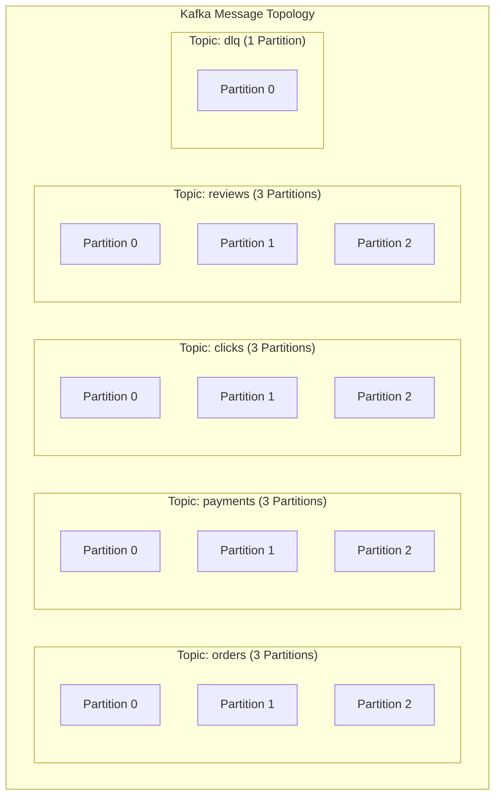

#### Structural Specifications
- **Topic Configuration**:
  - `orders`, `payments`, `clicks`, `reviews`: 3 partitions, replication factor 1.
  - `dlq`: 1 partition for centralized dead-letter processing.
  - Partitioning strategy: Murmur2 hashing on UUID keys (`order_id`, `payment_id`, etc.) provides uniform load distribution across consumer tasks.
- **Cluster Safeguards**:
  - `KAFKA_AUTO_CREATE_TOPICS_ENABLE: "false"`: Prevents unintended topic creation with default single partitions.
  - `KAFKA_LOG_RETENTION_HOURS: 4`: Limits broker disk consumption to 4 hours of retention, optimal for local developer environments and ephemeral staging.
  - `kafka-init` container: Automated lifecycle script ensures topics exist with designated partition counts before ingestion starts.

---

### 3. Distributed Stream Processing Engine (`spark/`)

Processing is partitioned into two decoupled modules:
1. `transformations.py`: Stateless and stateful pure PySpark transformation functions (fully decoupled from I/O to enable headless local unit testing).
2. `spark_stream.py`: Runtime orchestration managing Kafka streaming sources, micro-batch triggers, checkpoint states, and database sinks.

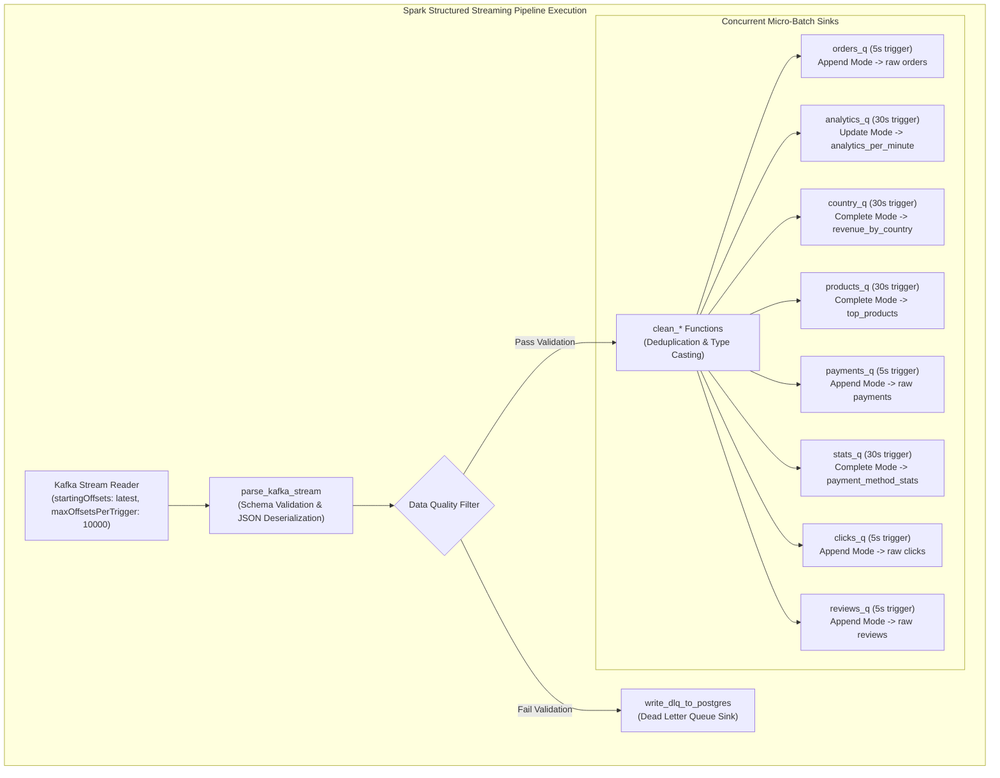

#### Stream Windowing & Algorithmic Optimizations
- **Watermarking Semantics**:
  ```python
  orders_df.withWatermark("event_timestamp", "10 minutes")
  ```
  Enables bounded state memory by dropping events arriving more than 10 minutes past the current event-time horizon.
- **Tumbling Windows**:
  1-minute tumbling windows compute transaction totals, revenue velocity, and distinct users per minute.
- **Memory-Bounded Cardinality Estimation**:
  Uses `approx_count_distinct("user_id")` (HyperLogLog algorithm) instead of standard exact distinct counts. In streaming state stores, exact distinct counts require retaining all historical IDs in memory, leading to memory leaks and executor Out-Of-Memory (OOM) failures under sustained loads.
- **Backpressure Regulation**:
  `maxOffsetsPerTrigger: 10000` limits batch sizing during recovery or broker lag spikes, preventing executor starvation.
- **Stream-Stream Joins**:
  Includes `join_orders_payments()` which matches order events with their corresponding payment events within a 2-minute event-time watermark window using inner join semantics.

---

### 4. Storage & Persistence Architecture (`database/`)

PostgreSQL 15 acts as the centralized analytical store. It is partitioned into three logical tiers: Raw Ingestion, Aggregation Tables, and Query-Accelerating Views.

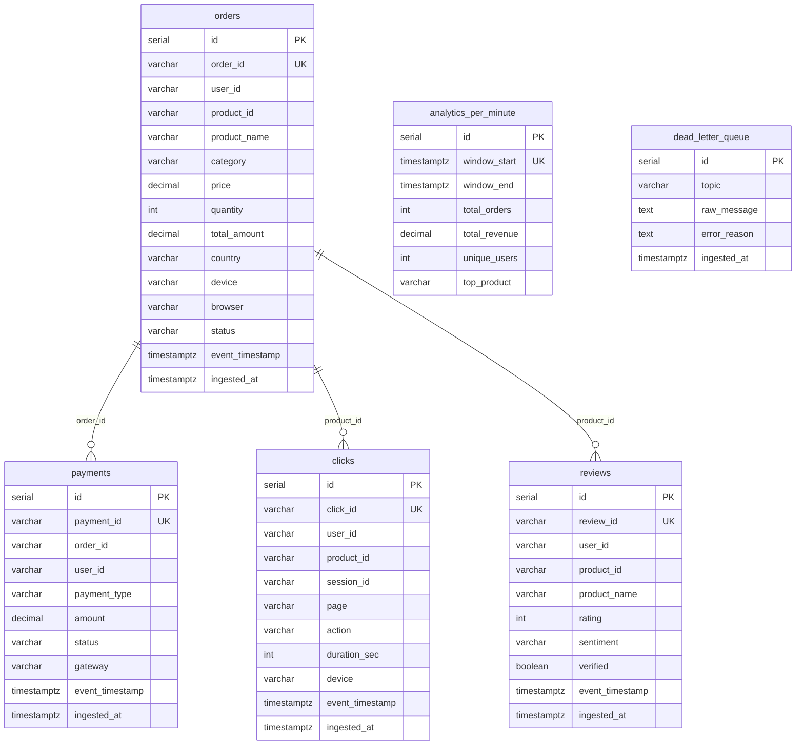

#### Idempotency & Database Sink Strategy
Spark's standard JDBC writer does not natively support `ON CONFLICT` semantics. The codebase implements custom writers inside `foreachBatch`:
1. **Raw Event Sinks (Append Streams)**:
   - Evaluated on driver via `psycopg2.extras.execute_batch` with `ON CONFLICT ({conflict_col}) DO NOTHING`.
   - Guarantees that duplicate messages replayed from Kafka during network retries or Spark checkpoint recoveries do not result in duplicate records.
2. **Aggregated Time-Series Sink (`analytics_per_minute`)**:
   - Uses `ON CONFLICT (window_start) DO UPDATE SET total_orders = EXCLUDED.total_orders, total_revenue = EXCLUDED.total_revenue, unique_users = EXCLUDED.unique_users`.
   - Ensures late-arriving records within the watermark window update the corresponding minute interval accurately.
3. **Snapshot Aggregations (`revenue_by_country`, `top_products`, `payment_method_stats`)**:
   - Uses JDBC in `mode("overwrite")` to replace full batch state every 30 seconds.
4. **Dead Letter Queue (`dead_letter_queue`)**:
   - Quarantines records that fail schema validation (null IDs, invalid prices, out-of-bounds ratings). Includes original topic, JSON payload, and failure reason for debugging.

#### Indexing & View Strategy

```sql
-- Indexes for Sub-Second Grafana Query Latency
CREATE INDEX idx_orders_timestamp   ON orders   (event_timestamp DESC);
CREATE INDEX idx_orders_country     ON orders   (country);
CREATE INDEX idx_orders_category    ON orders   (category);
CREATE INDEX idx_payments_timestamp ON payments (event_timestamp DESC);
CREATE INDEX idx_analytics_window   ON analytics_per_minute (window_start DESC);
```

Precomputed Views (`v_realtime_summary`, `v_orders_per_minute`, `v_payment_split`, `v_top_10_products`, `v_revenue_by_country`) encapsulate rolling 1-hour windows so Grafana panels execute fast queries without calculating aggregations over millions of rows on every refresh.

---

### 5. Observability & Dashboard Subsystem (`dashboard/`)

Grafana is provisioned as code via container volume mounts, eliminating manual UI configuration during deployment:
- `datasources/postgres.yml`: Auto-connects PostgreSQL as the default data source with connection pooling (`maxOpenConns: 10`, `maxIdleConns: 5`).
- `dashboards/dashboard.yml`: Auto-discovers JSON dashboards on container startup.
- `dashboards/ecommerce.json`: Comprehensive 11-panel dashboard with a default 5-second auto-refresh rate.

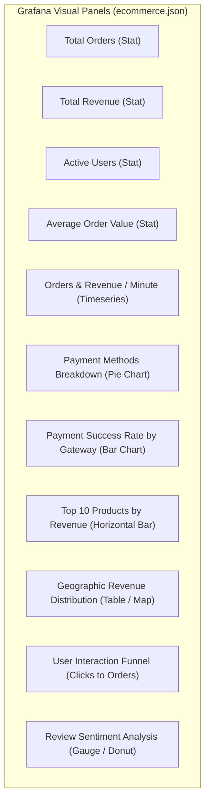

---

## End-to-End Data Flow & Interaction Lifecycles

### 1. Happy Path: Order Ingestion to Dashboard Metric

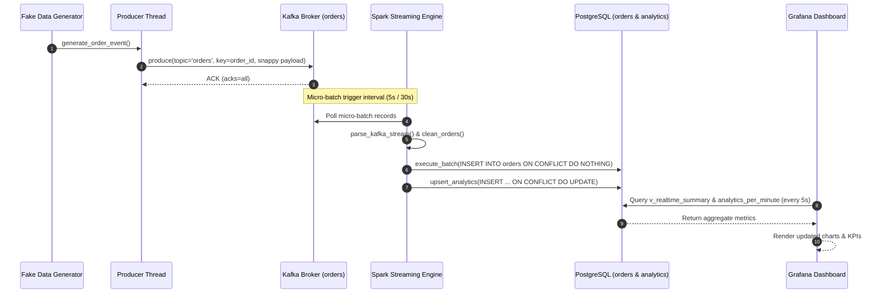

### 2. Anomaly & Malformed Record Quarantine Flow

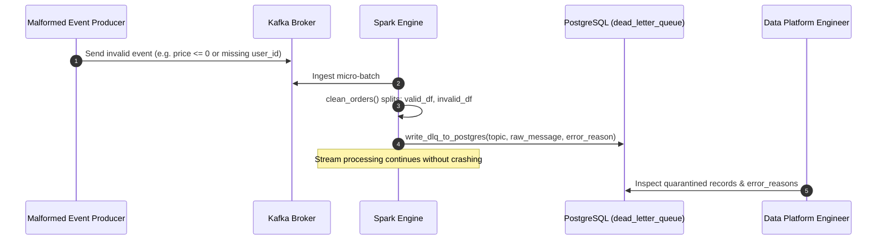

---

## Reliability, Fault Tolerance & Recovery Architecture

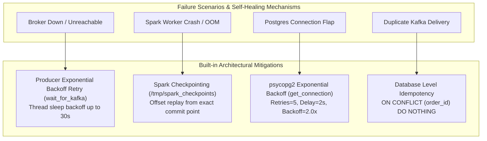

1. **At-Least-Once Delivery to Exactly-Once Processing**:
   - Kafka guarantees at-least-once message delivery.
   - Spark Structured Streaming manages consumer group offsets within transactional checkpoint logs (`/tmp/spark_checkpoints/*`).
   - Idempotent PostgreSQL inserts (`ON CONFLICT DO NOTHING`) ensure duplicate reads resulting from job retries are discarded at zero data corruption risk.
2. **Graceful Shutdown**:
   - Producer traps `SIGINT` and `SIGTERM` signals, triggers an internal `stop_event`, stops worker threads, and calls `producer.flush(timeout=10)` to deliver in-flight buffers.
   - Spark executes with `spark.streaming.stopGracefullyOnShutdown=true`, ensuring existing micro-batches finish writing before container termination.

---

## Deployment Architectures: Local vs Remote

The repository supports dual deployment strategies:

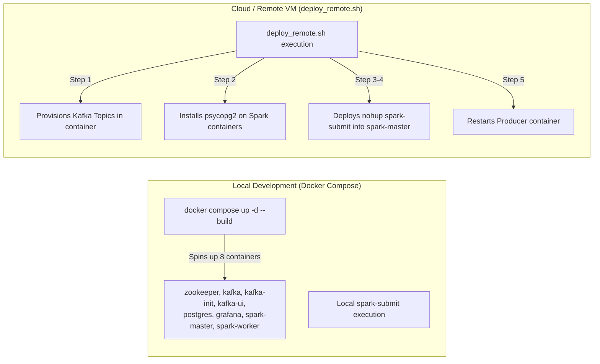

### Local vs Production Resource Footprint

| Service | Container Image | Port | Local Profile | Production Scaled Profile |
| :--- | :--- | :--- | :--- | :--- |
| **ZooKeeper** | `confluentinc/cp-zookeeper:7.5.0` | `2181` | 1 Node (512MB) | 3-Node Quorum or KRaft (ZooKeeper-less) |
| **Kafka** | `confluentinc/cp-kafka:7.5.0` | `9092, 29092` | 1 Broker (1GB) | 3+ Broker Cluster with RF=3, Min-ISR=2 |
| **Kafka-UI** | `provectuslabs/kafka-ui:latest` | `8080` | Single Instance | Protected behind OAuth/Ingress |
| **PostgreSQL**| `postgres:15-alpine` | `5432` | 1 Instance (1GB) | Managed RDS/Cloud SQL or TimescaleDB |
| **Spark Master**| `bitnamilegacy/spark:3.5.1` | `7077, 8081` | 1 Master (1GB) | Spark on Kubernetes / Dataproc / EMR |
| **Spark Worker**| `bitnamilegacy/spark:3.5.1` | `8082` | 1 Worker (4GB, 2 cores)| Multi-worker autoscaling pool |
| **Producer** | Custom Python 3.11 Image | N/A | 1 Container (~200MB) | Kubernetes CronJob / Event Bus Ingress |
| **Grafana** | `grafana/grafana:10.2.0` | `3000` | 1 Instance (~300MB) | Enterprise Grafana Cloud / HA Cluster |

---

## Architectural Review, Trade-Offs & Scaling Roadmap

### Identified Architectural Strengths
- **Clean Decoupling**: Business logic in `transformations.py` has no network dependencies and is 100% covered by pytest suite (`tests/test_transformations.py`).
- **Resilient Micro-Batch Ingestion**: Custom idempotent batch writing via psycopg2 resolves the lack of native `ON CONFLICT` support in PySpark JDBC.
- **Controlled Ingestion Backpressure**: Strict bounds on offsets per trigger (`maxOffsetsPerTrigger=10000`) protect against cluster memory exhaustion.

### Recommended Architectural Evolutions

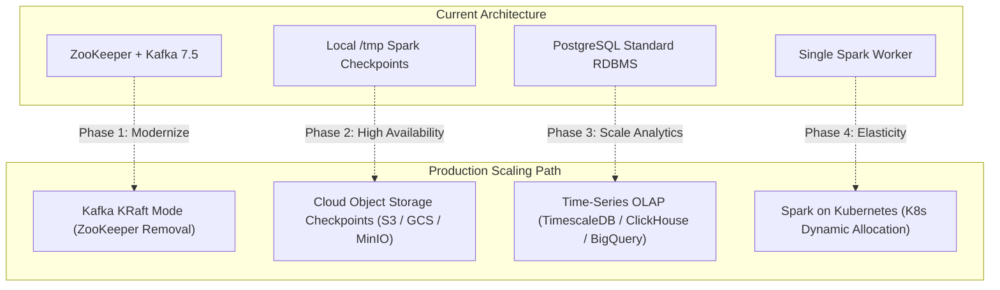

1. **Migrate to Kafka KRaft Mode**:
   - *Current*: Dependent on ZooKeeper (`zookeeper:2181`), introducing an additional operational failure domain.
   - *Recommendation*: Migrate to Confluent Kafka KRaft mode to simplify cluster architecture and reduce memory usage by ~25%.
2. **Persistent Remote Checkpoint Storage**:
   - *Current*: Spark checkpoints are stored in `/tmp/spark_checkpoints`, which is ephemeral and wiped upon container rebuild.
   - *Recommendation*: Map checkpoint directory to an external Docker persistent volume or S3/GCS bucket to ensure durability across node redeployments.
3. **Database Scalability for Large Historical Windows**:
   - *Current*: High write volume into a single PostgreSQL container (~100 inserts/sec).
   - *Recommendation*: As row counts exceed 50+ million records, apply automated table partitioning by `event_timestamp` or migrate analytical sinks to **ClickHouse** or **TimescaleDB** for sub-second aggregations over billions of events.
4. **Driver Node Batching vs Executor Direct Writes**:
   - *Current*: In `write_to_postgres`, `batch_df.collect()` brings data into driver memory to execute psycopg2 batch writes.
   - *Recommendation*: While performant for ~500-1,000 rows/micro-batch, at 10,000+ rows/sec this should be refactored using `rdd.foreachPartition` to allow distributed executors to write concurrently into PostgreSQL using a connection pool.
